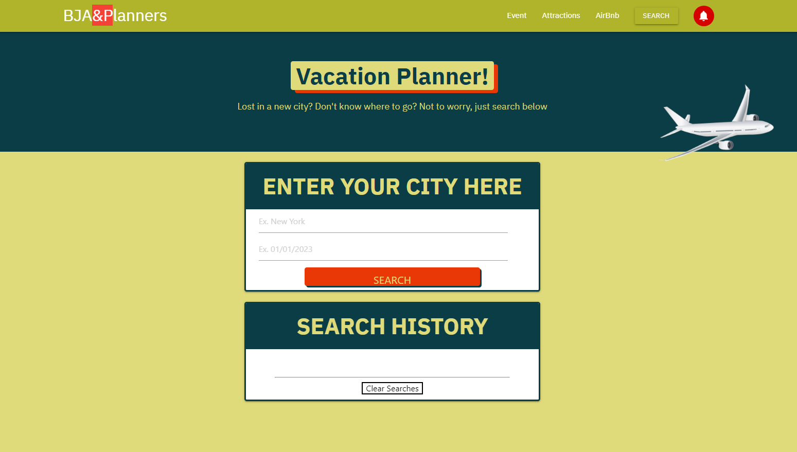

# group8-vacationplanner

## Description

For our first project, we decided to create a website to help people plan a trip.  By utilizing HTML, Materialize CSS and Javascript we built a website that allows a user to search by city and date. Once searched, the website will return local events, local breweries and AirBnb options for the area. Below are the URLs for the repository and the live website.

https://jsedlak146.github.io/group8-vacationplanner/

https://github.com/jsedlak146/group8-vacationplanner

## User Story

As a user
I want to be able to search for a city and date
And when I search for my vacation destination
I will be given lodging options and local attractions to help me plan my trip there

## Usage

Our website is very user friendly.  Navigate to the enter city tab and enter the name of where you are planning to go.  Next, enter the date you will be there on the line below and click search. You can then go down the page and check out the AirBnb listings for the city, local breweries and events that will be taking place on the specific date you searched for. If you want to see more results, you can click on the buttons below the cards and you will be presented with additonal results. Your previous searches for cities will be displayed in the Search History card below.

## Screenshot

## Licenses

n/a

## Credits

n/a